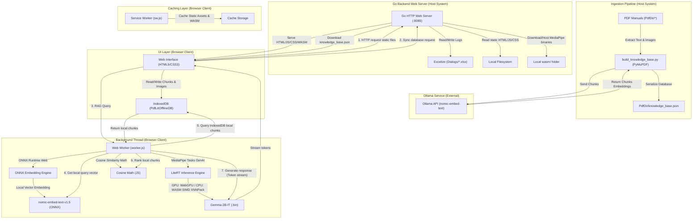

# PdfLrt Architecture (LiteRT Edition)

This document describes the architectural design, components, and data flows of **PdfLrt** (LiteRT Offline Document Assistant). It includes a Mermaid block diagram followed by detailed descriptions of each architectural element.
 
 
---

## 1. Architectural Diagram

---

## 2. Description of System Elements

### A. Host Ingestion Pipeline 

There is a shell script named `run_ingest.sh` or `run_ingest.bat` that creates a uv virtual env within Docker and launches a python script named `build-knowledge_base.py` that does the following: 
* **Role**:
  - Scans `PdfDir/` for PDF documents.
  - Extracts text, page numbers, and layouts using the **PyMuPDF (`fitz`)** library.
  - Detects figures and extracts them as JPEG images (encoded in base64 data URIs).
  - Segments the text into overlapping semantic chunks.
  - (DEMOTED) Connect to the local **Ollama** embedding endpoint to generate high-dimensional vectors for each chunk using `nomic-embed-text:latest`.
  - Serializes all parsed text, page references, figure metadata, and vector embeddings into a single static file: `PdfDir/knowledge_base.json`.

### B. Go Backend Web Server (`pdflrt.go`)
This is the coordinator on the host machine.
* **Role**:
  - Serves static assets (`index.html`, `app.js`, styles, etc.) to the client web browser.
  - Sets security headers: `Cross-Origin-Opener-Policy: same-origin` and `Cross-Origin-Embedder-Policy: require-corp`. These are mandatory for browsers to allow multi-threaded SharedArrayBuffer allocations used by WebAssembly / ONNX Runtime Web.
  - On startup, downloads MediaPipe GenAI WASM binaries from CDN to a local `wasm/` directory. This allows the client browser to resolve the WASM dependency locally (same-origin), avoiding Cross-Origin Resource Policy (CORP) blockages in strict offline/secure contexts.
  - **Dialogue Archiver**: Generates Excel files (`PdfLrt_Dialog_YYYYMMDD_HHMMSS.xlsx`) at `/api/savedialog` using the Excelize Go package to preserve dialogue logs.

### C. PWA Frontend (`index.html` & `app.js`)
The user-facing PWA interface.
* **Role**:
  - Offers a modern, responsive chat interface.
  - Handles client-side state, user configuration parameters, and speech APIs (Web Speech API).
  - Implements **Sync Knowledge Base**: Downloads the compiled `knowledge_base.json` database from the Go server and stores it in the client browser's local **IndexedDB** database (`PdfLrtOfflineDB`).
  - Manages client-side RAG workflow, routing queries to the background Web Worker and rendering the streamed token responses.

### D. Service Worker (`sw.js`)
The offline enabler for PWA capabilities.
* **Role**:
  - Runs in a background browser context.
  - Caches all static codebase dependencies (`index.html`, `app.js`, icons, `transformers.min.js`, etc.) into Cache Storage.
  - Intercepts browser network requests. If the host server is offline or the client is disconnected, it serves the cached assets directly, allowing the application to load quickly even without a network connection.

### E. Web Worker (`worker.js`)
A background execution thread in the browser dedicated to the heavy mathematical and machine learning calculations.
* **Role**:
  - Prevents freezing the UI thread during local inference calculations.
  - Loads **ONNX Runtime Web** (via `transformers.min.js`) to run `nomic-embed-text-v1.5` locally, generating 768-dimensional query vector embeddings.
  - Loads **LiteRT (MediaPipe Tasks GenAI)** from the local `wasm/` directory to run the LLM.
  - Loads the local LLM model asset (`gemma-2b-it-cpu-int4.bin` or similar) via WebGPU (or falls back to CPU WASM SIMD with XNNPack acceleration).
  - **Offline RAG execution**:
    1. Generates query vector embedding locally using ONNX.
    2. Performs Cosine Similarity search locally against IndexedDB chunks.
    3. Retrieves top matched chunks and merges them as context.
    4. Submits the prompt to LiteRT `LlmInference` and streams tokenized output back to the UI.

END OF DOC
---